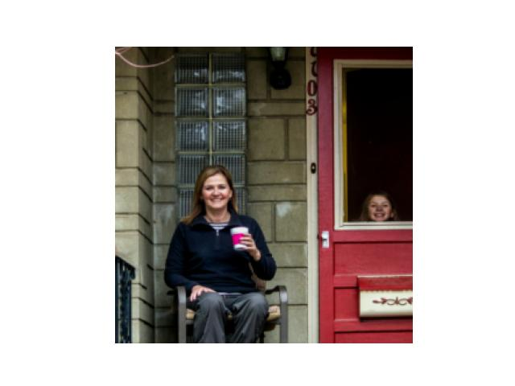
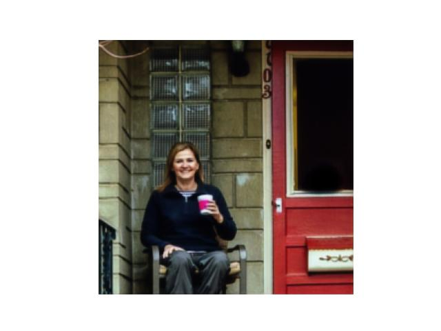
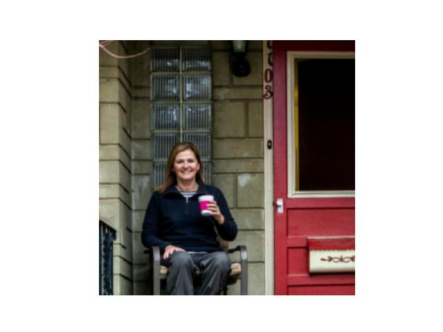

# PhotoFix
The project involves training a U-Net model to remove photobombed objects from images. The model is trained on a dataset containing:
Original images: Images with photobombed objects.
Ground truth images: Corresponding images with photobombed objects removed using editing tools.
The trained model takes a photobombed image as input and generates a clean, photobomb-free image as output.
# Dataset
The dataset consists of triplet of 300 images:
Original Images: Images containing photobombed objects.
Ground Truth Images: Images with photobombed objects removed using editing tools.
binary masks: Binary images containing the mask around the photobombed objects.
The dataset was preprocessed to ensure consistency in size and format. Images were resized and normalized for training.
dataset was taken from kaggle and can be found <a href = "https://www.kaggle.com/datasets/vatsapatel09/image-de-photobombing-benchmark-dpd-300-dataset">here </a>
# Architecture
The U-Net architecture was used for this task. U-Net is a convolutional neural network (CNN) designed for image segmentation and restoration tasks. It consists of:
Encoder: A series of convolutional and max-pooling layers to extract features.
Decoder: A series of upsampling and convolutional layers to reconstruct the image.
Skip Connections: Connections between encoder and decoder layers to preserve spatial information.
for training the original images and binary masks were stacked together such that the input to the unet model had 4 channels. another approach would be to predict both the reconstructed images and the binary mask. however the former approach worked better. The model was trained using Mean Squared Error (MSE) loss to minimize the difference between the predicted and ground truth images.
# Results
Input (Photobombed Image) -  
 
output (debombed Image) - 
 
ground truth -  

